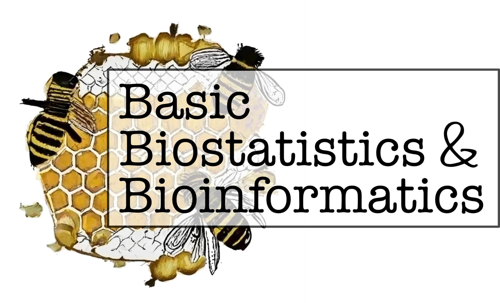

::: {.hero}
::: {.logo-card}
{.hero-logo fig-alt="The 3 Bees logo: Basic Biostatistics & Bioinformatics"}
:::

::: {.tagline}
Short lectures and hands-on tutorials in **basic biostatistics and
bioinformatics** — a collaboration between SLUBI and the SLU Center for Statistics.
:::

[Browse the workshops](workshops.qmd){.btn .btn-honey .btn-lg}
[Suggest a topic](https://docs.google.com/forms/d/e/1FAIpQLSfojHf02MqnsVTgKK_tE403ogGI1Pfi9vLg1A407w4SrQbIIw/viewform){.btn .btn-hive .btn-lg}
:::

::: {.bee-stats}
- [29]{.num} [sessions]{.lbl}
- [Since]{.lbl} [Nov 2023]{.num}
- [Free]{.num} [&amp; open to everyone at SLU]{.lbl}
:::

## About the series {.unnumbered}

The **3 Bees — Basic Biostatistics & Bioinformatics** is a series of short
lectures and hands-on tutorials that introduce topics and methods to help with
your research projects, especially (but not only) bioinformatics. It is a
collaboration between **SLU's Center for Statistics** and **SLUBI**, SLU's
bioinformatics infrastructure.

Every session is beginner-friendly — come to just listen, or bring a laptop and
follow along. Slides, tutorials, and code from each session are collected here.

## Recent sessions {.unnumbered}

::: {#recent}
:::

[See all workshops →](workshops.qmd)
